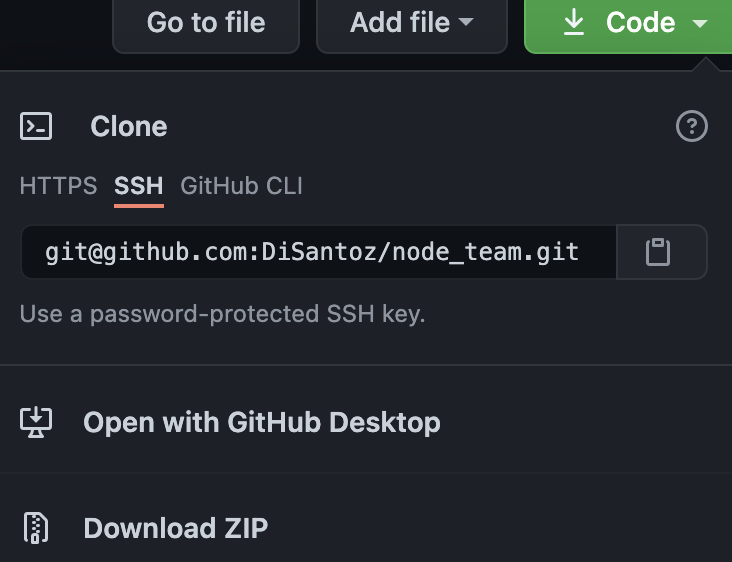
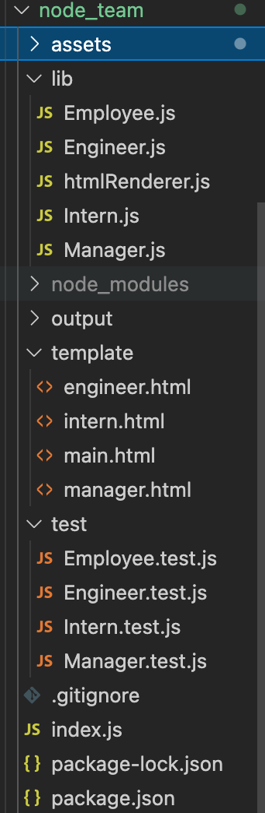
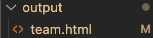
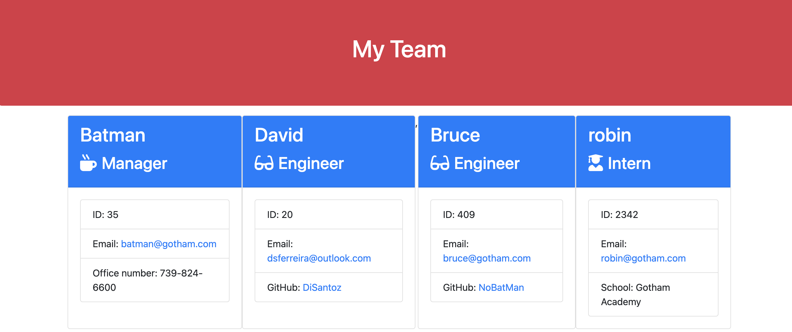

# node_team

## Description

  Using Node and NPM Inquirer I developed a command-line application that dynamically generates a an website that displays a team's basic info such as their email, phone number and GitHub profiles!

  ## Table of Contents
  * [Installation](#installation)
  * [Usage](#usage)
  * [License](#license)
  * [Credits](#credits)
  * [Tests](#tests)
  * [Questions](#questions)
  

  ## Installation

  1. Git clone my repository 

  

  2. On the command line, in the root of the directory type `npm install`. 

  3. Make sure that package.json, package-lock.json and node_modules is all properly displaying

  

  4. Change the script in package.json to read: ` "test": "jest" `

  5. Run `npm test` to ensure all tests `PASS`!

  6. Once all tests pass, simple run `node index` to begin inputing information about your team.

  ## Usage

  Please see attached [video](https://drive.google.com/file/d/1L59mA0YRb5yH7BKAjXjd4N5TRsg_rrNu/view?usp=sharing) on how to use this application!

  

  ## License
  Read more about the license here:
  
  https://choosealicense.com/licenses/mpl-2.0
  
  
  
  ## Credits
  
`Kevin Ferguson` provided the starter code for this project! 
  
  
  ## Tests

  After following the installation process and usage steps above, you'll receive a message saying: `Your Website is complete and ready to be viewed!` 

  You'll find the html file located under the output file:
  
  

  Simply open the HTML file in your browser and enjoy your Teams Website!.

  

  ## Questions
  
  Hi my name is [DiSantoz](https://github.com/DiSantoz) the developer behind nodeMe !

  
  If you have any questions about the usage of this project or any suggestions on how to better this project please feel free to contact me at:

  dferreira91@outlook.com